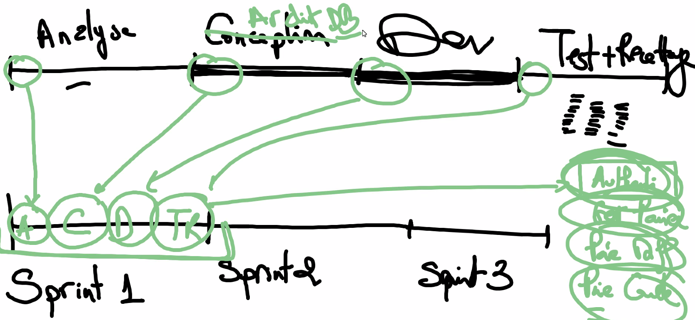
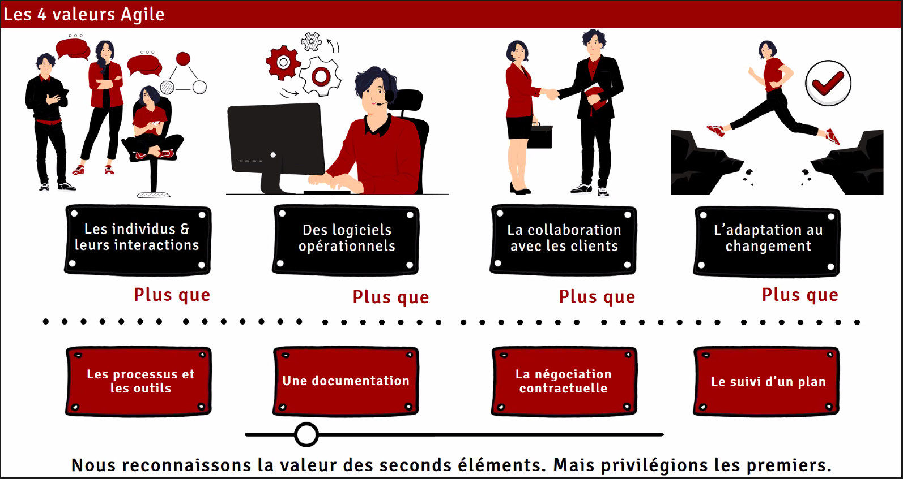
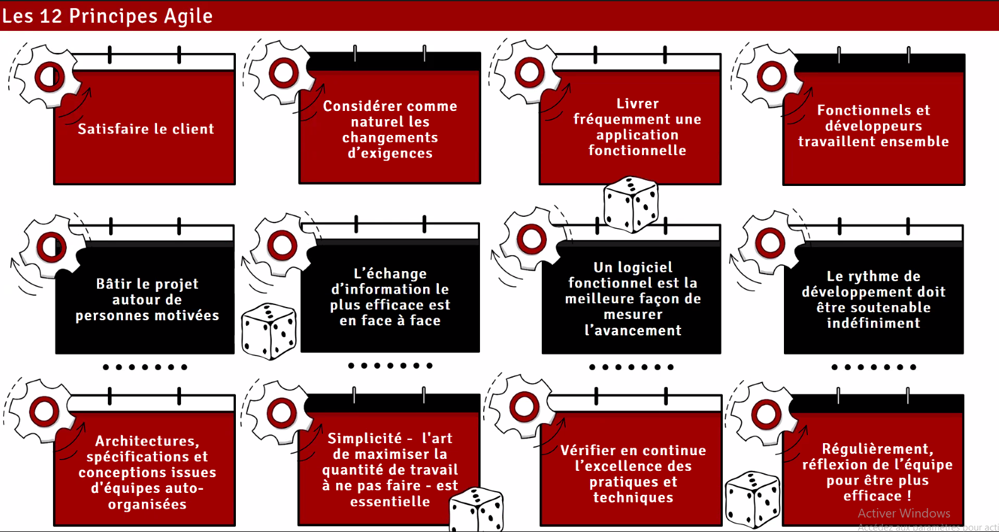
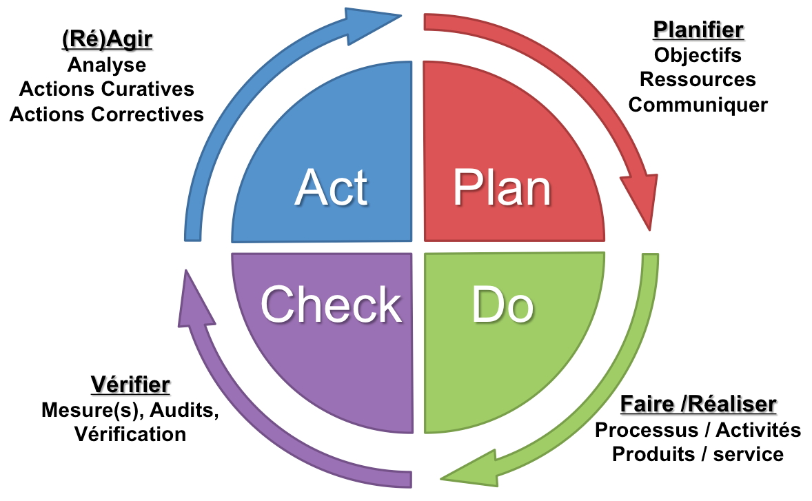
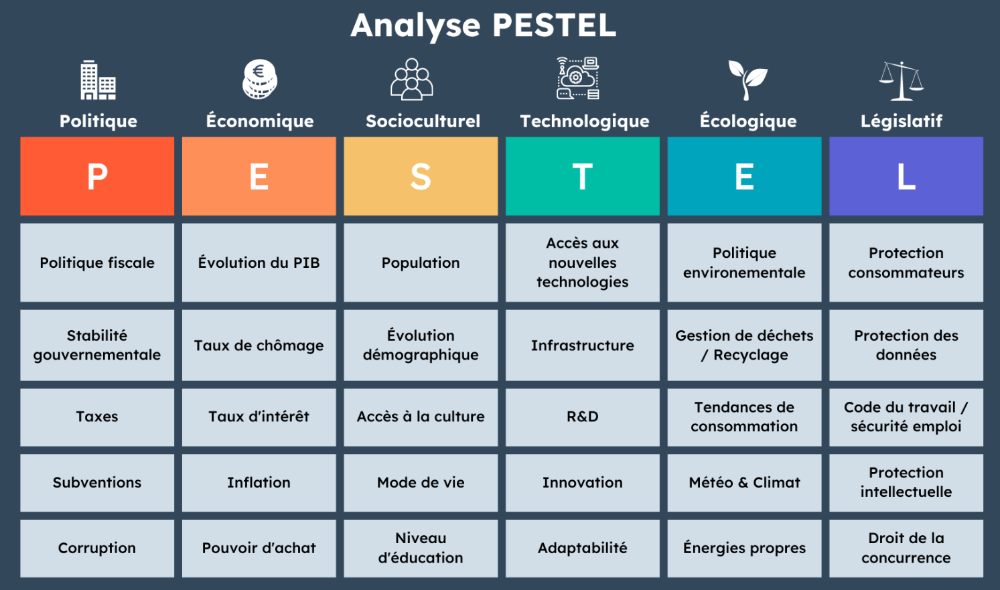
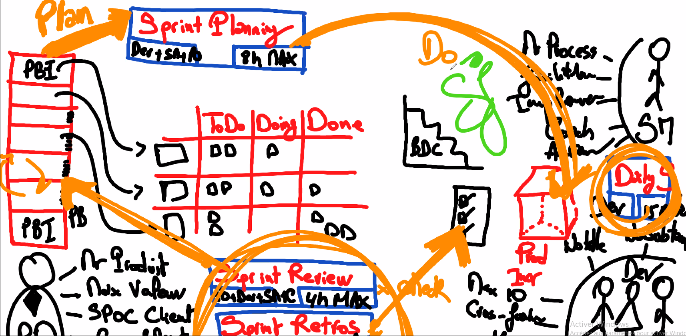

# AGILE

## Définition d'un projet

### Qu'est-ce qu'un projet ?
Un projet est toujours défini par :
- Effort temporaire
- Date de début
- Date de fin
- Résultat unique

Lors d'un projet, il y a toujours une définition à l'avance. Un projet n'est pas nécessairement professionnel.

## Responsabilité
Il est de la **responsabilité de l'émetteur** de bien se faire comprendre et que tout le monde ait réussi à le comprendre. 

***Le client** n'est pas nécessairement capable d'exprimer avec précision son besoin et il faut l'accompagner dès la définition de son projet afin de le rendre réalisable. Cela retombera sur nous si nous ne le bridons pas.

## Pourquoi utiliser AGILE ?

**Avantage principal :** Cela permet de manoeuvrer pour se rapprocher au maximum possible du 0 (gaspillages, dépassemment, etc.)

L'agilité est très mauvaise lors de projets précis, tout comme elle est excellente dans d'autres types de projets. Le management de projet classique est un modèle solide mais il possède des limites et n'est pas optimal pour tout type de projets.

L'**agilité est une approche**, une culture voire un état d'esprit.

Permet d'éviter l'effet papillon (un petit problème peut en cacher un bien plus grand), l'effet boule de neige ainsi que l'effet tunnel.

### Quelles sont les causes "racines" d'un échec ?
- **Besoin (56%) alias le "Quoi ?"** : Mauvaise définition du besoin, mauvaise compréhension voire écriture du besoin. Cahier des charges mal écrit.
- **Process (27%) Comment ?**
- **Compétences techniques, équipes choisies (10%), le "Qui ?"** / le dev sur un projet informatique.
- **Autres (7%)** : environnement, surprises / événements innatendus.

### Chef de projet ?
Lors d'un projet agile, le rôle de chef de projet est décomposé en deux sous-rôles :
- **Product Owner** : le propriétaire du produit. S'occuper du besoin. S'occupe de la valeur, du Product Backlog et des items (PBI). Refuser ou valider les livrables
- **Scrum Master** : aussi appelé Process Owner. S'occuper du processus.

Les **développeurs** (troisième rôle) ne sont gérés par aucun "chef". Il n'y a pas de chef en projet agile, à part un "chef produit" et un "chef process". Les développeurs peuvent être jusqu'à 10. Développeur est un rôle qui comprend les concepteurs, les devs, les architectes, les équipes, etc. 

### Feedback
Lors d'un projet agile, l'un des points les plus importants est de briser l'effet "tunnel". On doit **chercher à obtenir des retours fréquemment**, il faut **régulièrement communiquer afin de s'assurer du bon déroulement du projet**. Communiquer de manière trop espacée ou uniquement à la fin du projet augmente considérablement ses chances d'échecs.

Pour délivrer un feedback, il faut quelque chose de mesurable. Il faut un incrément fini, un produit incomplet. Un **incrément** est une partie du produit qui progresse jusqu'à atteindre le résultat final.

### Sprint
Le **but d'un sprint** est de fonctionner par itération, tout en récoltant des feedbacks à la fin de celui-ci. 

Il faut définir un objectif clair, on procède par sprint plutôt que par phases. Un sprint est constitué de diverses parties des "phases" d'un projet normal.

Phases : Analyse => Conception => Dev => Test+Recettage  
Sprint : sprint 1 => sprint 2 => sprint 3

La **durée d'un sprint** est d'une à quatre semaines. La durée du sprint varie en fonction du projet et de l'objectif. Une fois la durée d'un sprint définie, elle reste la même pour tous les autres sprints.

Les diverses réunions sont inclues dans la durée d'un sprint. Lorsqu'un sprint se termine, un autre commence directement.

### Les facteurs de qualité

Lors d'un projet, 3 facteurs importants peuvent affecter la qualité.

Le dérèglement de n'importe lequel des 3 facteurs, sans adapter les autres, va dégrader la qualité :
- Ajouter du contenu sans augmenter le coût ou les délais va créer une situation où nous n'avons ni le temps ni l'argent de le faire, la qualité se réduit.
- Diminuer le budget, le coût va faire que nous n'aurons pas les moyens pour réaliser le contenu demandé dans le délai imparti
- Diminuer le temps accordé au projet sans augmenter le budget ni réduire le contenu va diminuer la qualité.

Ces facteurs fonctionnent en équilibre, en affecter un va affecter les autres. Si on ne s'adapte pas, cela dégradera évidemment la qualité.

### Quand utiliser Agile ?
**Management classique :** Quand le projet est clair et bien défini.

**Agile :** Quand le **projet est complexe et changeant** (parasites, facteurs environnementaux).

Verouiller le scope : Uniquement en management classique, après le cahier des charges. En projet informatique, il faut nécessairement utiliser une approche agile puisque le résultat est très variable et de nouvelles requêtes client apparaissent fréquemment.

### Les 4 valeurs Agile

En managment de projet classique, nous utilisons les éléments en rouge.  
En approche Agile, les 8 éléments sont à prendre en compte.

### Les 12 principes Agile

Celui-ci est également composé de 3 "P":
- **People** : Personnes motivées et communication efficace en face à face.
- **Product** : Livrer une app fonctionnelle + cela est la meilleure façon de mesurer.
- **Process** : Vérifier l'excellence des pratiques et réflexion en équipe.

Sur le 10è principe (Simplicité) : cela inclut d'éviter le gaspillage et la **NVA** (Non Valeur Ajoutée).  
Exemple intéressant avec le Japon et les trois principes : Muri, Mura et Muda. Que l'on peut aussi appeler le **principe d'amélioration continu**.

## Scrum
Scrum (mêlée) est un **framework** qui se base sur l'agilité. Il **ajoute un cadre de travail à l'approche Agile**.

Notion de **Timebox** : Chaque tâche possède son propre temps assigné et il n'est pas possible de dépasser cette limite.

**Les quatre types de réunion lors d'un sprint** :
- **Sprint planning** / Réunion d'initialisation : le sprint planning. Réalisée en début d'un sprint. Aussi appelé "événement" ou "ceremony". Dure maximum 8h, soit 2h par semaines de sprint. Définir l'objectif du sprint.
- **Daily Scrum** (ou Stand-up meeting): réunion quotidienne, durée max : 15min. Dev uniquement. Le Scrum Master peut y assister mais il ne doit pas participer (sauf pour faire respecter le time box).
- **Sprint review** (toute l'équipe + parties prenantes, 1h par semaine) et **sprint retrospective** (PO, Scrum Master et devs, 45min par semaine) : Ces deux réunions s'enchaînent. Une réunion pour discuter du produit et une seconde pour discuter du process.

Scrum est un process empirique, il se base sur l'expérience.

### Roue de Deming
Lrincipe de l'amélioration continue / PDCA est essentiel en Agile :

### Valeur et priorité
**Qu'est-ce que la valeur ?**  
Une valeur importante va être le désir du client, les features qu'il souhaite en priorité. Il peut vouloir quelque chose d'assez vague sauf sur certains points. Réaliser ces fameux points rapidement augmentera beaucoup la valeur et l'intérêt du produit en développement à ses yeux.

**Par quoi commencer ?**  
Entre le désir majeur du client et notre priorité en tant que technicien, la priorité doit être du côté du client. Surtout si cela ne nous impacte pas.

En début de projet, le Product Owner va arriver avec une liste des besoins. Celle-ci doit être priorisée, notamment car ces besoins auront beaucoup de valeur pour le client. Ces besoins sont rédigés à travers un **Product Backlog**.

### Product Backlog
Première étape d'un projet : **Rédiger et prioriser le Product Backlog** (équivalent d'un cahier des charges)  
Le product backlog est constitué de **Product Backlog Items** (PBI).

**Note :** À la différence d'un cahier des charges, le Product Backlog doit être capable d'évoluer au cours du projet. Notamment afin de suivre des "User Story" évolutives.

Le Product Owner peut en venir à modifier le PB, selon des retours avec le client il peut modifier la priorité ou ajouter des détails. Ces actions sont appelées **Product Backlog Refine** ou **Grooming**.

Outils pour **réaliser un PB** : possible d'utiliser **Trello** pour créer des items et résumer l'ensemble des PBI. On peut aussi inclure le **Sprint Backlog** grâce au système de tâches délimitées dans le temps et d'assignation d'utilisateurs.

### Sprint Backlog
Un exemple classique de Sprint Backlog pourrait être un tableau Kanban : **Décomposer les tâches d'un ou plusieurs PBI en plusieurs statuts de complétion** (ex: TO-DO, On-going and Done).

Des PBI sont choisis en fonction de leur priorité et durée, ils sont ensuite décomposés en tâches. Les PBI à travailler sur la durée du sprint sont déterminés par les développeurs et les tâches sont également définies par eux.

### Définitions

**Partie prenante** : Personne physique ou morale (une société, l'état, une législation ou une instance gouvernementale/continentale (ex: RGPD)). Qu'elle soit interne ou externe et qui peut influencer le projet, de près ou de loin, de manière positive ou négative.

**PESTEL** (Politique, Économique, Socioculturel, Technologique, Écologique, Légal) : Facteurs externes qui peuvent influencer un projet.

**Cancel the sprint** : Lorsqu'un Sprint devient de la NVA à cause d'un facteur extérieur. Extrêmement rare. Il est alors possible d'annuler un Sprint. Action uniquement réalisable par un PO.

**Le cône d'incertitude :** Au début d'un projet, l'incertitude est à 100%. Plus nous progressons dans un projet et plus l'incertitude diminue par l'ajout de feature et le déroulement des sprints. 

### 3 Piliers de SCRUM
- **Transparence** : Être transparent, partager les informations de manière claire et correcte. Rendre visibles les problèmes
- **Inspection** : Vérifier. Une fois les problèmes visibles, il faut les inspec­ter. 
- **Adaptation** : Grâce à cette inspec­tion, on pourra alors s’adap­ter grâce à des actions visant à amélio­rer la situa­tion.

### 5 Valeurs de Scrum
- **Focus** : Être focalisé sur l'objectif, sur le sprint en cours, le projet, le scope. Ne surtout pas être Out of Scope.
- **Ouverture** : Être ouvert aux autres, aux changements, aux nouvelles idées ou suggestions. Entraide.
- **Respect** : Respecter le périmètre de chacun, les autres, les priorités, les deadlines, les TimeBox, le produit, le projet, les parties prenantes, le process, etc. 
- **Courage** : Fast fail / Safe fail. Avoir le courage de se tromper, d'interagir régulièrement avec le client, accepter les nouvelles idées, accepter le changement, les responsabilités, quitter sa zone de confort.
- **Engagement** : Envers l'équipe, envers le produit, envers la société/entreprise à laquelle nous appartenons.

**5 Critères de l'équipe :** Auto-organisés, multidisciplinaire, pas de titres, pas de sous-équipes et maximum 10.

### Acceptance Criteria
Inclus dans le Product Backlog Item, les critères d'acceptation doivent être spécifiés et respectés. Ce sont des détails primordiaux à la réalisation de la tâche.

### Definition of Done
Ce document fait partie du process, ce sont aux développeurs de définir ce qu'ils vont mettre dedans.

 Comme le nom l'indique, ce document a pour but d'indiquer les critères et les tâches à réaliser afin de pouvoir définir un élément comme terminé. Que ce soit un PBI ou une tâche.

### Burn Down Chart

Avec la Burn Down Chart, on peut remarquer l'évolution de la complétion des PBI. La courbe n'est pas en pente puisqu'on regarde uniquement lorsque l'item est DONE. S'il n'est pas Done, alors on continue.

Si le PO a une remarque, l'équipe retourne sur l'item précédent :

## Résumé

**3 rôles** : Product Owner, Scrum master et Dev.

**3 artéfacts** : Product Backlog, Sprint backlog, et Product Increment.

**4 réunions** : Sprint planning, Daily scrum, sprint review et sprint retrospective.

**Rôles du Product Owner** : Gère le produit. Maximise la valeur ajoutée. SPOC (Single Point of Contact) avec le client. Crée et maintient le Product Backlog.

**Rôles des développeurs** : auto-organisés, pas de sous-équipes, max 10, pas de titres et multifonctions.

**Rôles du Scrum Master** : Gère le process. Facilitateur, élimine les obstacles. Coach et anime.

**PDCA :**
- **Plan** : Sprint planning, en se basant sur les PBI.
- **Do** : Commence après le sprint planning, se termine lorsque nous rendons l'incrément livrable.
- **Check** : Sprint review + sprint retro. Ce qui a fonctionné, ce qui a échoué, etc.
- **Act** : Agir sur le Product Backlog en changeant le PB, notamment les priorités, etc.

